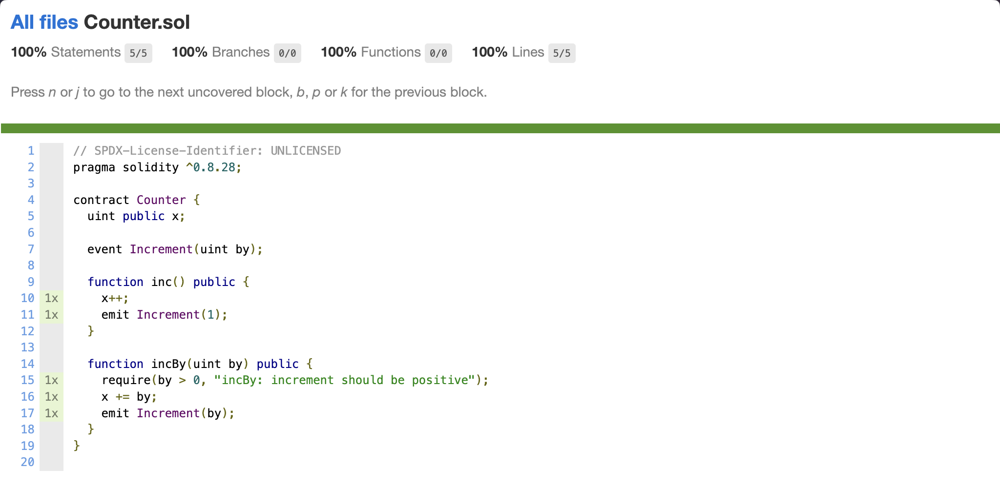

import Run from "@hh/Run.astro";

Hardhat 3 has built-in support for code coverage, making it easy to see which parts of your contracts are tested. To use it, run

<Run command="hardhat test --coverage" />

This will show you the combined coverage of all your tests. A Markdown report is printed to the terminal, while LCOV and HTML reports are generated in the `coverage` folder.

You can also use the `--coverage` flag with individual tests or test subtasks. For example, this shows the coverage of a single Solidity test:

<Run command="hardhat test solidity contracts/Counter.t.sol --coverage" />

## How code coverage works

Hardhat instruments your Solidity smart contracts by adding markers that it detects at runtime and uses to compute code coverage for your test runs.

This approach has several benefits:

- Your code coverage won't change with different solc versions
- It works with optimized code

However, this comes with some side effects:

- The bytecode of your contracts running in coverage mode is different and larger
- The gas costs of your contracts when running in coverage mode are higher
- The `allowUnlimitedContractSize` [setting of `edr-simulated` networks](/docs/reference/configuration#simulated-network-options) is automatically set to `true` when using `--coverage`

## HTML report generation

An HTML report is generated in the `coverage/html/index.html` file. You can open it in your browser to see the coverage results of all your contracts.

The code coverage report has an index with all your files, which looks like this:

Clicking on one of the files will open a page like this, displaying its code coverage results:

## `lcov` file generation

The `lcov` format is shared among many programming languages to report code coverage results.

When you run Hardhat with `--coverage`, an `lcov` file with the results is stored in `coverage/lcov.info`.

### Displaying the `lcov` results in Visual Studio Code

You can use the [Coverage Gutters](https://marketplace.visualstudio.com/items?itemName=ryanluker.vscode-coverage-gutters) Visual Studio Code extension to see the results of your code coverage within your contract files.

Install the extension and run the command "Coverage Gutters: Watch" (`coverage-gutters.watchCoverageAndVisibleEditors`).

Whenever you open a contract file after having run your tests with `--coverage`, you'll see the results right next to the line numbers.
